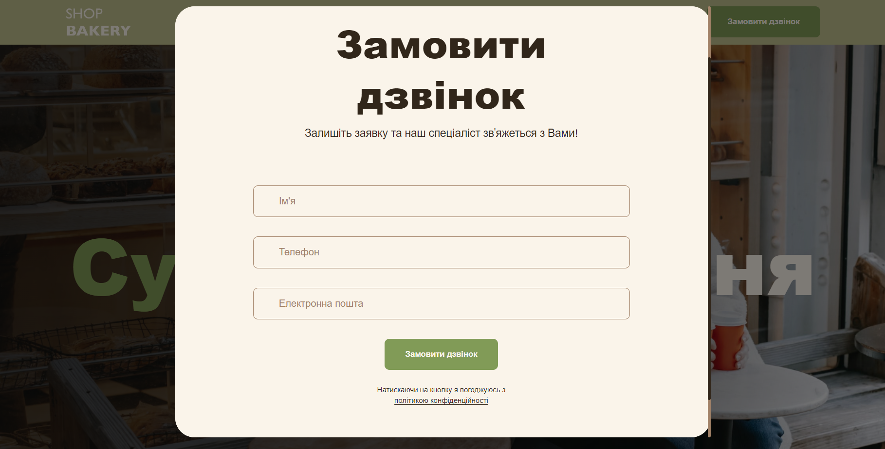
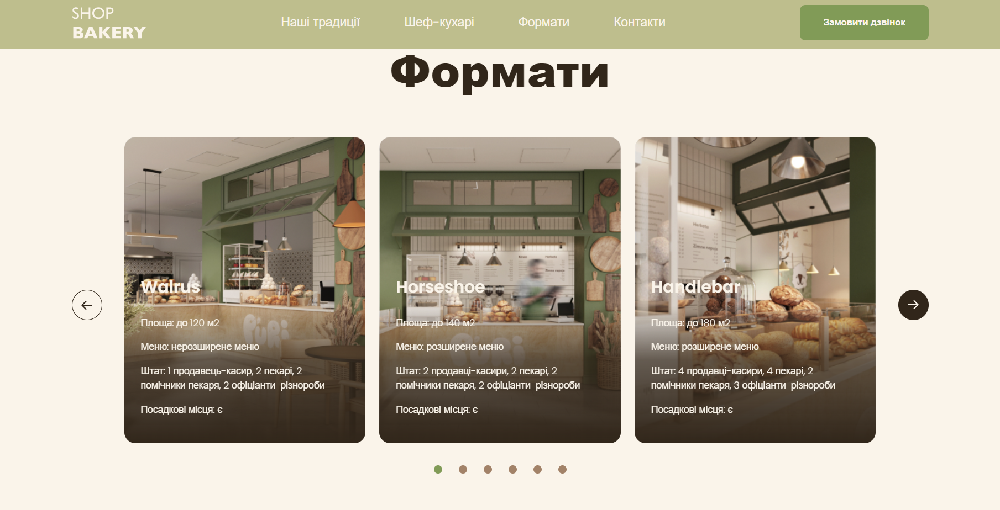

# Hi, everybody 
## Let's get acquainted))
I'm Mary) I'm 21) I programmed Arduino boards in college, but I've always wanted to be a Front-end developer)) As we know, desire is a huge power)) I started simple: I learnt html and css) 
As a result, I got this Landing Page) 
  
In general, enough chatter, follow the link, and see for yourself)😉 
 
https://marylapinia.github.io/genius-test/
## About project

### Built With
- 
- 
- 
- 
- 

## Usage
### Main Page

  <ul>
    
<li>
  If you follow the link, you will see in front of you a Landing Page created for a modern bakery. You will be able to get all the information you need to visit this bakery. You will also have the opportunity to place an order. To do this, you will need to fill out a form on the site and someone from the bakery will be sure to contact you!
</li> 

 
    
<li>
  At the top of the page is the navigation, which will allow you to quickly move around the page. And also there is a button for making a call, clicking on which you will see a form that you need to fill out
</li> 

<li>
  In the "Formats" section there are slider cards that will be scrolled by clicking on the arrow or the circles below the cards. These cards can be made into links that will take you to new pages with more information about the bakery and the technologies used
</li> 

 

<li>
  Landing Page is adaptive for desktop and mobile versions
</li> 

  </ul>

 ### Thank you for your attention and allocation of time!🤗  Success in your studies and work)  Take care of yourself))

 ## My Contacts 
 

   <ul>

  <li>
     
  </li>
  
  <li>
      
  </li>

  <li>
  
  </li>

<li>
  
</li>
  
  </ul>
  

